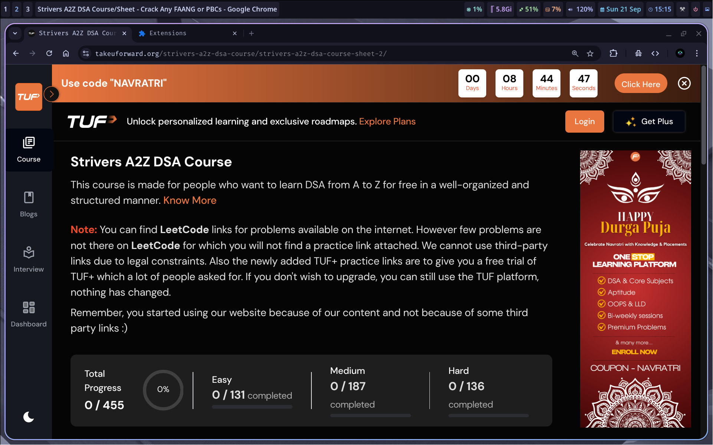
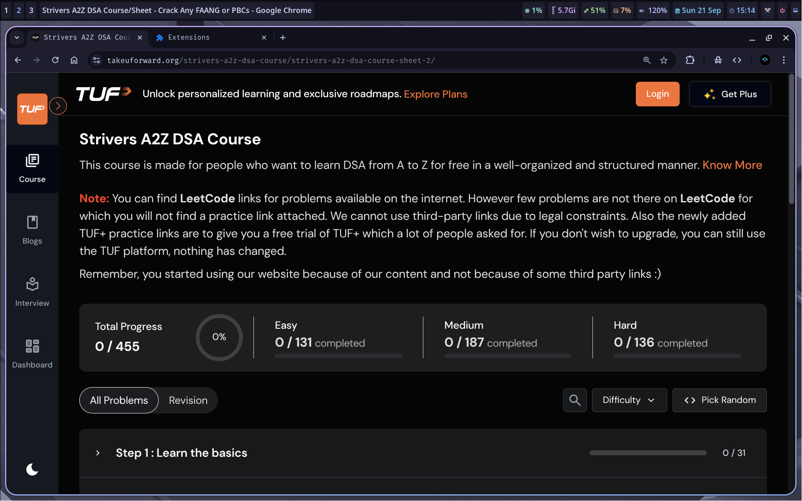

# TakeUForward Cleaner Browser Extension

TakeUForward Cleaner is a browser extension (works on both **Chrome** and **Firefox**) designed to enhance your experience on the TakeUForward website by removing distractions, cleaning up the UI, and providing a focused environment for learning and practicing coding problems.

TakeUForward Cleaner is a Chrome extension designed to enhance your experience on the TakeUForward website by removing distractions, cleaning up the UI, and providing a focused environment for learning and practicing coding problems.


## Before & After

<p align="center">
   <b>Before:</b><br>
   
</p>

<p align="center">
   <b>After:</b><br>
   
</p>

## Features

- **Distraction-Free Experience:** Automatically hides or removes unnecessary elements, ads, and popups from the TakeUForward website.
- **Custom Styling:** Applies a clean and modern stylesheet for improved readability and focus.
- **Lightweight & Fast:** Minimal performance impact, ensuring a smooth browsing experience.
- **Easy to Use:** Installs in seconds and works automatically—no configuration required.


## Installation

### 1. Clone or Download the Repository
```zsh
git clone https://github.com/code-with-aneesh/tuf-cleaner.git
cd tuf-cleaner
```

### 2. Load the Extension in Your Browser

#### For **Google Chrome**
- Open `chrome://extensions/` in your browser.
- Enable **Developer mode** (top right).
- Click **Load unpacked** and select the project folder.

#### For **Mozilla Firefox**
- Open `about:debugging#/runtime/this-firefox` in your browser.
- Click **Load Temporary Add-on**.
- Select the `manifest.json` file from the project folder.

> **Note:** In Firefox, the extension will be removed when you close the browser. For permanent installation, you need to package and sign the extension via the [Firefox Add-ons Developer Hub](https://addons.mozilla.org/en-US/developers/).

## Usage

- Visit [TakeUForward](https://takeuforward.org/) and enjoy a cleaner, distraction-free interface.
- The extension works automatically—no setup required.

## Project Structure

- `manifest.json` – Chrome extension manifest file.
- `content_script.js` – Main script that modifies the TakeUForward website.
- `styles.css` – Custom styles applied to the website.
- `icon.png` – Extension icon.

## Contributing

Contributions are welcome! Please open an issue or submit a pull request for suggestions, bug fixes, or new features.

## License

This project is licensed under the MIT License.

---

**Created with ❤️ by [Aneesh](https://github.com/code-with-aneesh)**
